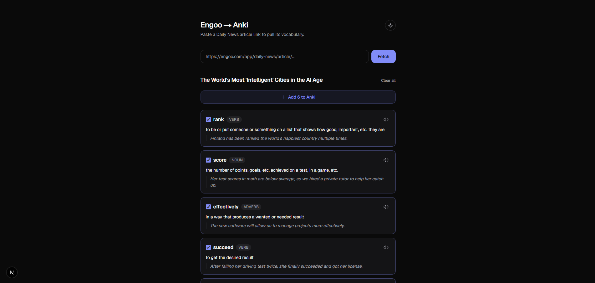

# Engoo → Anki

[](../../actions/workflows/ci.yml)
[](LICENSE)
[](https://nextjs.org)

Turns an [Engoo Daily News](https://engoo.com/app/daily-news) article into Anki flashcards definition, part of speech, example sentence and pronunciation audio.



## Requirements

- Node.js 24 or newer
- Anki desktop with the **AnkiConnect** add-on (*Tools → Add-ons → Get Add-ons*, code `2055492159`, then restart)

Anki must stay open while you use the app AnkiConnect runs inside it.

## Getting started

```bash
npm install
npm run dev
```

Open http://localhost:3000 and paste an article URL.

## Usage

1. **Fetch** loads the article's vocabulary. Nothing is written to Anki yet.
2. Uncheck any words you already know.
3. **Add to Anki** creates one card per selected word.

Cards land in a deck named `Engoo` with a note type named `Engoo Vocab`, both created on first run. Importing the same article twice is safe words already in your collection are skipped and reported as duplicates.

### Card fields

| Field | Example |
| --- | --- |
| `Word` | get on with |
| `PartOfSpeech` | Phrasal Verb |
| `Definition` | to begin or continue doing something |
| `Example` | I have a lot of work to finish, so I'd better get on with it. |
| `Audio` | `[sound:0tjjo14raxlfxv2y1etulu.mpga]` |

Some older lessons have no recorded audio; those cards are silent.

## Project structure

| Path | Role |
| --- | --- |
| [`src/lib/engoo.ts`](src/lib/engoo.ts) | Reads an article from Engoo's undocumented JSON API |
| [`src/lib/anki.ts`](src/lib/anki.ts) | Creates the deck, note type, media and cards |
| [`src/app/actions.ts`](src/app/actions.ts) | Server Actions the form submits to |
| [`src/app/components/`](src/app/components/) | Form, word list, theme toggle |

Both integrations run server-side: AnkiConnect and the Engoo API each reject cross-origin browser requests, and a Server Action sends no `Origin` header.

Non-obvious constraints in both API clients are documented as comments at the top of `engoo.ts` and next to the code they affect in `anki.ts`. Read those before refactoring several look like dead weight and are not.

## Limitations

- **Runs locally only.** The app talks to `localhost:8765`; deployed anywhere else it would reach the server's localhost, not yours.
- **Engoo's API is undocumented** and may change without warning. The symptom would be fewer words than the article shows, rather than an error.
- **Cards are English → English.** Engoo only provides word translations in Japanese and Thai.

## Scripts

| Command | Description |
| --- | --- |
| `npm run dev` | Start the dev server |
| `npm run build` | Production build |
| `npm start` | Serve the production build |
| `npm run lint` | Run ESLint |
| `npm test` | Run the test suite |
| `npm run test:watch` | Re-run tests on change |

## Contributing

Issues and pull requests are welcome. Before opening a PR, please run:

```bash
npm run lint
npm run build
```

The API clients in `src/lib/` carry comments explaining constraints that were found by testing against a live Anki instance. If a change touches those, verify it against real Anki rather than assuming several of the constraints are invisible in a second run (see the note about cold imports in `anki.ts`).

## License

[MIT](LICENSE) © Aurolv

Not affiliated with Engoo or Anki. Engoo's API is undocumented and used here for personal study.
